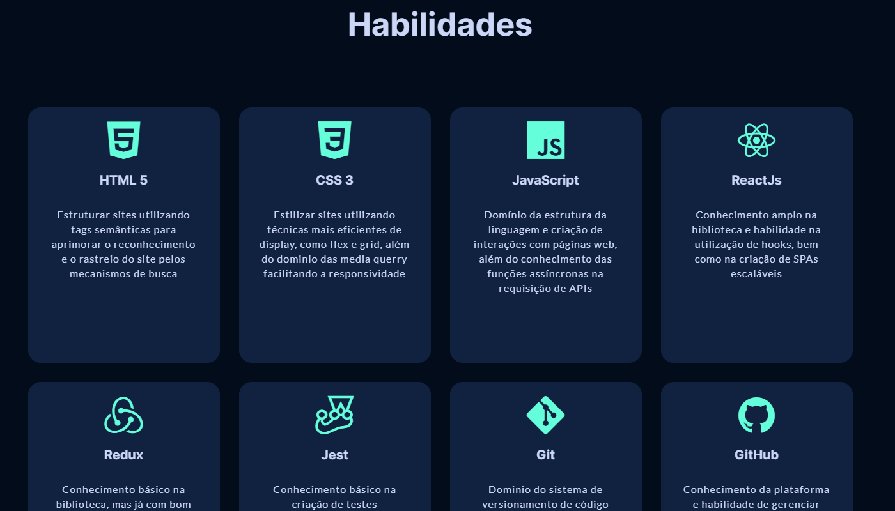
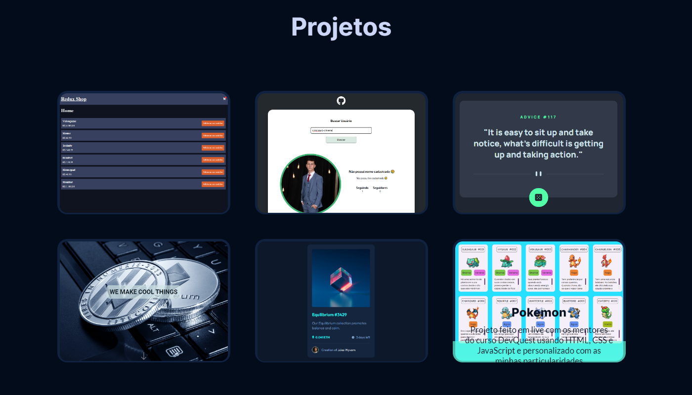

# 👉 Portfólio de Projetos Pessoais - Vinícius Bueno de Oliveira 👈

🚀 Bem-vindo ao meu portfólio de projetos pessoais! Meu nome é Vinícius Bueno de Oliveira e este é o lugar onde compartilho os projetos que desenvolvi. Aqui, você encontrará uma coleção de trabalhos que demonstram minha paixão pelo desenvolvimento e minha habilidade de criar aplicações web escaláveis.

 

## 📜 Sobre o Projeto 📜

Este portfólio foi criado para apresentar meus projetos pessoais e destacar minhas habilidades em desenvolvimento web. Utilizei somente HTML e CSS para construir este projeto, com o objetivo de demonstrar minha proficiência nessas tecnologias fundamentais.

## 🌐 GitHub Pages (Deploy)

O projeto está hospedado no GitHub Pages. Você pode acessá-lo [aqui](https://vinicius-b-oliveira.github.io/portfolio/).

## 🚧 Desafios Enfrentados 🚧

🔥 Desenvolver um portfólio pessoal foi uma oportunidade incrível para aplicar minhas habilidades em programação. Enfrentei o desafio de criar uma interface atraente e responsiva, garantindo que meu portfólio seja acessível em diversos dispositivos.

## 📸 Visuais 📸

Você pode visualizar algumas imagens do site !

|  |  |
|:---:|:---:|
|  |  

## 🌟 Melhorias Futuras 🌟

🔮 Estou sempre procurando maneiras de melhorar meu portfólio. No futuro, pretendo adicionar mais projetos interessantes e interativos, bem como reconstruir o mesmo utilizando ReactJs.

## 🏃‍♂️ Como Executar o Projeto Localmente 🏃‍♀️

Para executar este projeto localmente, siga estas etapas:

1. Clone este repositório: `git clone https://github.com/Vinicius-b-oliveira/portfolio.git`
2. Navegue até o diretório do projeto: `cd portfolio`
3. Abra o arquivo `index.html` em um navegador web.

## 🤝 Contribuição 🤝

Fique à vontade para abrir issues e pull requests se você tiver sugestões de melhorias para o meu portfólio. Sua contribuição é muito bem-vinda!

## 📬 Contato 📬

Você pode entrar em contato comigo por email: viniciusbuenodeoliveira2017@gmail.com ou me seguir nas redes sociais:

|  |  |  |
|:---:|:---:|:---:|
| Instagram | Whatsapp | Linkedin |
